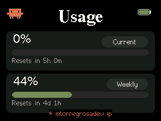
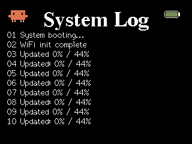

# Clawdmeter M5Fire

Desk-side monitor for real-time Claude Code usage tracking via WiFi.

<table style="width: 100%; border-collapse: collapse;">
  <tr>
    <th style="text-align: center;">Splash Screen</th>
    <th style="text-align: center;">Usage Dashboard</th>
    <th style="text-align: center;">System Logs</th>
  </tr>
  <tr>
    <td style="width: 33%;"></td>
    <td style="width: 33%;"></td>
    <td style="width: 33%;"></td>
  </tr>
</table>

## Overview
Clawdmeter M5Fire is a dedicated hardware monitor designed to keep track of your Anthropic Claude API usage limits. It provides a visual dashboard showing session utilization, weekly limits, and time remaining until reset.

## Hardware
- **M5Stack Fire**: ESP32-S3 based controller with a 2.16" AMOLED display (480x480).
- **WiFi Connectivity**: Standard 2.4GHz 802.11b/g/n.
- **Battery**: Internal Li-Po battery providing approximately 8 hours of continuous operation.

## How it Works
The system is divided into two main components:

### 1. Web Scraper Daemon (Mac)
A Python-based daemon that runs on your workstation. It uses **Playwright** to navigate to your Claude.ai settings page, scrapes usage percentages and reset timers, and serves this data through a lightweight local HTTP API.

### 2. ESP32 Firmware
A C++ application that runs on the M5Stack Fire. It polls the daemon's API every 30 seconds, manages the user interface, and displays character animations that react to your current usage rate.

## Remote Usage & Tailscale
Because the device communicates via HTTP over WiFi, you are not limited to your local home network. By using a virtual private network like **Tailscale**, you can point the M5Fire to your Mac's Tailscale IP address. This allows the monitor to work from any location with internet access while your Mac stays securely at home running the daemon.

## Installation

### 1. Daemon Setup
```bash
cd daemon
pip3 install requests playwright
playwright install
python3 wifi-api-daemon.py --port 8080
```

### 2. Firmware Setup
1. Copy `firmware/include/config.h.example` to `config.h` and set your Mac's IP address.
2. Build and upload the firmware using **PlatformIO**.
3. On first boot, connect to the `ClawdMeter-Setup` WiFi network to configure your network credentials via the captive portal.

## Security
- **No Hardcoded Credentials**: WiFi passwords and IP addresses are managed via the captive portal and stored locally in NVS/EEPROM.
- **Privacy**: The daemon runs entirely on your local machine. No Claude tokens or account data are sent to external third-party servers.
